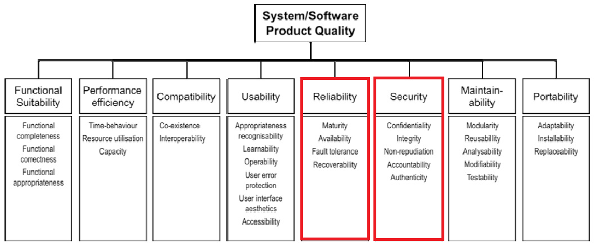
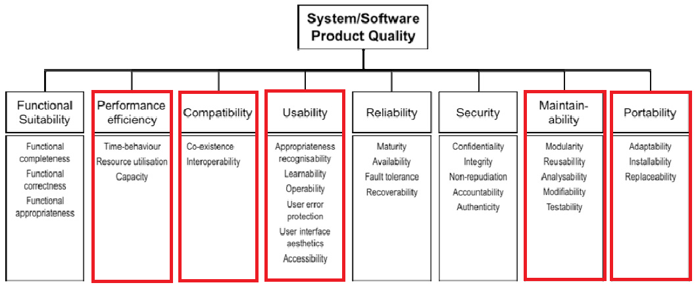

# Requirements (systeemeisen)

Requirements definiëren is cruciaal voor het slagen van een project. 

Bij softwareontwikkeling wordt te vaak teveel de prioriteit gelegd bij functionaliteit (functionele requirements) en ontwikkeltijd en security en andere kwaliteitsaspecten (nietfunctionele requirements) zijn vaak slechts bijzaak, krijgen geen of nauwelijks prioriteit.

## Functionele- en Niet-functionele requirements

Requirements vertellen wat het te ontwikkelen systeem moet kunnen, de eisen aan het gedrag of de kwaliteit van het systeem. **Functionele **requirements beschrijven specifiek gedrag of functies, die het systeem moet vervullen (user requirements). **Niet-functionele** requirements specificeren criteria om het functioneren van het systeem te beoordelen, de zgn. kwaliteitseisen, maar beschrijven niet het specifieke gedrag zelf, hieronder vallen bijvoorbeeld betrouwbaarheid en beveiligbaarheid. De ISO-norm 25010 beschrijft kwaliteitskenmerken van softwaresystemen. Het model voor productkwaliteit (Product quality model, zie figuur 4) onderscheidt acht hoofdcategorieën: Functionele geschiktheid, Prestatie-efficiëntie, Uitwisselbaarheid, Bruikbaarheid, Betrouwbaarheid, Beveiligbaarheid, Onderhoudbaarheid, Overdraagbaarheid (Wikipedia, 2020). De ISO/IEC25010 is een Internationale standaard voor de productkwaliteit van software gedefinieerd naar Functionele eigenschappen en Niet-functionele eigenschappen. Deze norm is te downloaden via de bibliotheek van de HHS via de databank van NenConnect.

## Betrouwbaarheid en Beveiligbaarheid

### **Betrouwbaarheid (Reliability)**

De mate waarin een systeem, product of component gespecificeerde functies uitvoert onder gespecificeerde condities gedurende een gespecificeerde hoeveelheid tijd. De ISO/IEC25010 maakt een verdere onderverdeling naar: 

* **Volwassenheid (Maturity)**: De mate waarin een systeem, product of component aan betrouwbaarheidsbehoeften voldoet onder normale werkomstandigheden (aangetoonde betrouwbaarheid).
* **Beschikbaarheid (Availability)**: De mate waarin een systeem, product of component operationeel en toegankelijk is wanneer men het wil gebruiken. 
* **Foutbestendigheid (Fault tolerance)**: De mate waarin een systeem, product of component werkt zoals bedoeld ondanks de aanwezigheid van hard- of softwarefouten.
* **Herstelbaarheid (Recoverability)**: De mate waarin het product of systeem, in geval van een onderbreking of bij een fout, de direct betrokken gegevens kan herstellen en het systeem in de gewenste staat kan terug brengen.

### Beveiligbaarheid (Security)

De mate waarin een product of systeem informatie en gegevens beschermt zodat personen, andere producten of systemen de juiste mate van gegevenstoegang hebben passend bij hun soort en niveau van Autorisatie(\*). De ISO/IEC25010 maakt een verdere onderverdeling naar: 

* **Vertrouwelijkheid (Confidentiality)**: De mate waarin een product of systeem ervoor zorgt dat gegevens alleen toegankelijk zijn voor diegenen die geautoriseerd zijn.
* **Integriteit (Integrity)**: De mate waarin een systeem, product of component ongeautoriseerde toegang tot of aanpassing van computerprogramma’s of gegevens verhindert.
* **Onweerlegbaarheid (Non-repudiation)**: De mate waarin kan worden bewezen dat acties of gebeurtenissen plaats hebben gevonden, zodat later deze acties of gebeurtenissen niet ontkend kunnen worden. 
* **Verantwoording (Accountability)**: De mate waarin acties van een entiteit getraceerd kunnen worden naar die specifieke entiteit.
* **Authenticiteit (Authenticity)**: De mate waarin bewezen kan worden dat de identiteit van een onderwerp of bron is zoals wordt beweerd. De mate waarin een claim over de oorsprong of de auteur van de informatie verifieerbaar is, bijvoorbeeld aan handschrift.

## Overige Niet-functionele requirements

* Performance/efficiency: prestaties/capaciteit van dataverwerking
* Compatibiliteit: werken in meerdere verschillende omgevingen\
  Gebruiksgemak: eenvoud(minder foutgevoelig) voor de gebruiker
* Onderhoudbaarheid: eenvoudig wijzigen van de functionaliteiten
* Overzetbaarheid: code bruikbaar in andere platformen

## Privacy requirements

De invoering van de AVG in mei 2018 met als doel de verbetering van de bescherming van persoonsgegevens van alle burgers in de EU heeft grote consequenties voor het ontwerpen en bouwen van webapplicaties. De AVG schrijft voor dat persoonsgegevens, alle informatie over een geïdentificeerde of identificeerbare natuurlijke persoon (Autoriteit Persoonsgegevens, wat-zijn-persoonsgegevens, 2021), beschermd moet worden tegen misbruik en dat ieder individu zeggenschap blijft houden over zijn/haar persoonsgegevens en privacy. Een speciale categorie persoonsgegevens, de zgn. bijzondere persoonsgegevens (Autoriteit Persoonsgegevens, mag-u-persoonsgegevens-verwerken, 2021) genieten zelfs nog extra bescherming via de wet. Het gaat hierbij om gegevens op basis waarvan gediscrimineerd kan worden zoals ras, godsdienst, strafblad, politieke gezindheid etc.

Een webapplicatie heeft als belangrijke functie de interactie met gebruikers en deze interactie bestaat eruit dat gebruikers (persoonlijke)gegevens delen die vaak worden opgeslagen in een database. Webapplicaties zorgen voor privacy-problemen in de vorm van datalekken of Function creep(\*), het in de loop van de tijd nieuwe functies toevoegen waardoor gegevens worden gebruikt voor andere doeleinden dan de doeleinden waarvoor de gebruiker oorspronkelijk toestemming heeft verleend. Dit laatste wordt vergemakkelijkt omdat webapplicaties eenvoudig zijn uit te breiden waarbij de inhoud van databanken online kan worden gekoppeld aan die van andere databanken. Data kunnen worden gebruikt voor allerlei surveillancedoeleinden maar bijvoorbeeld ook (illegaal) worden verhandeld of worden doorgesluisd naar andere databanken (zie ook H.2.3 Nissenbaum). Dit vraagt dan ook extra aandacht voor de AVG en alle rechten en verantwoordelijkheden die deze wet met zich meebrengt.

Voor het opstellen van de privacy-requirements voor een webapplicatie moet categorie 5 van de AVG (zie Bijlage 1) Privacy by Design & Default verplicht meegenomen worden.

## Opstellen van de requirements

### Data at rest, in transit & in use

Gegevens in een applicatie kunnen zich in drie toestanden bevinden in rust (at rest), in overdracht (in transit) en in gebruik (in use). Data in use is data die worden verwerkt, gelezen of gebruikt. Data at rest zijn opgeslagen data in databanken, opgeslagen cookies, logging files, emails. Data in transit (in motion) zijn data die, in een flow, worden getransporteerd tussen systemen of tussen applicaties of tussen de diverse onderdelen van applicaties zelf. In alle drie de staten moet de beschikbaarheid, integriteit en vertrouwelijkheid adequaat worden beschermd.

Een gegevensstroomdiagram (data flow diagram, DFD) illustreert de stroom en de transformatie van gegevens voor een bepaald bedrijfsproces. Het is een visuele weergave van de manier waarop gegevens door een systeem stromen bestaande uit Processen, Stores, Actors en/of DataFlows, zodat duidelijk te zien is waar de gegevens vandaan komen, waar ze naartoe gaan en hoe ze worden opgeslagen.

### Belanghebbenden

Verschillende applicaties krijgen verschillende eisen mee op het gebied van de informatiebeveiliging, omdat ze in de praktijk heel anders gebruikt worden en daarmee ook een heel andere impact van incidenten hebben. Kwaliteitseisen kunnen vanuit verschillende stakeholderperspectieven bekeken worden. Softwareproducten en software-intensieve computersystemen hebben veel belanghebbenden, waaronder degenen die ontwikkelen, verwerven, gebruiken of die klant zijn van bedrijven die software-intensieve computersystemen gebruiken.

De kwaliteitsmodellen uit de ISO/IEC25010 bieden een kader voor het verzamelen van de behoeften van verschillende belanghebbenden, waarbij een verdeling wordt gemaakt in:

* Primaire gebruikers die interacteren met het systeem om de primaire doelen te bereiken.
* Secundaire gebruikers die ondersteuning bieden (content provider, systeem manager/administrator, security manager), installatie en beheer.
* Indirecte gebruikers die output ontvangen, maar geen interactie hebben met het systeem.

Elk van deze typen gebruikers heeft behoefte aan kwaliteit in gebruik en productkwaliteit in bepaalde gebruikscontexten (zie tabel 1 van de ISO/IEC25010).

Voor het vaststellen van de requirements is het van belang om te weten wie informatie eigenaar is. De term ‘eigenaar’ verwijst naar een persoon of entiteit die de managementverantwoordelijkheid heeft voor het beheersen van de productie, de ontwikkeling, het onderhoud, het gebruik en de beveiliging van de asset. Deze informatie eigenaar bepaalt de (beveiligings)eisen die gesteld kunnen worden aan de informatie en is een belangrijke bron bij het opstellen van de requirements.

Het stellen van goede eisen is de crux van applicatieontwikkeling. En dit geldt ook voor de beveiliging ervan. Het is het fundament onder Security by Design. Voor security en betrouwbaarheid gelden met name: “omdat het moet”: wetgeving of compliancy eisen, AVG indien persoonsgegevens verwerkt worden en “omdat je het wil”: belang van de data, het proces, reputatie/imago, beveiligen van vertrouwelijkheid, integriteit, beschikbaarheid.
