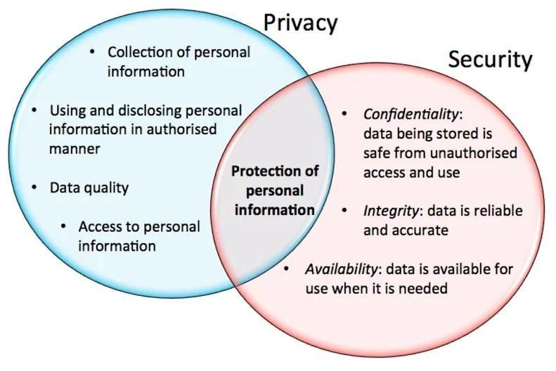
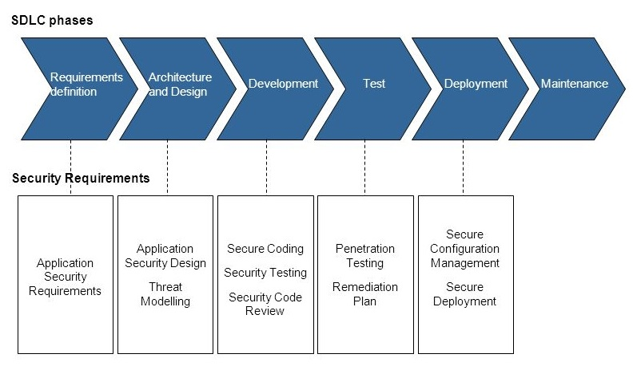

# Security by Design \(SbD\)

Security by Design houdt in dat bij het ontwerpen van de applicatie al rekening gehouden wordt met de informatiebeveiliging die vanaf het begin zou moeten worden ingebouwd. Bij het ontwerp wordt nagedacht over betrouwbaarheid van het systeem zelf vanuit de BIV factoren \(Beschikbaarheid, Integriteit, Vertrouwelijkheid\). Kwetsbaarheden in het ontwerp van de applicatie worden daarbij geminimaliseerd.

Een eis inbrengen in een bestaande applicatie is duurder en minder effectief dan de eis gelijk meenemen bij het ontwerp en de inzet van maatregelen vanaf het begin houdt effectiever securityfouten tegen dan met reparaties achteraf. 

## Privacy by Design \(PbD\)

Privacy en veiligheid zijn gerelateerd. Privacy by Design wil zeggen dat privacy al bij het ontwikkelen van de applicatie bij het vaststellen van de requirements meegenomen wordt. Privacy by design draait om het beschermen van persoonsgegevens en het ondersteunen van gebruikers in hun rechten om controle uit te oefenen op de verwerking van de eigen persoonsgegevens.

## Secure Software

Waarom zou je secure software willen ontwikkelen?

1. “Omdat je het wil”
   * Kritische data die beschermd moet worden. 
   * Kritische processen die bestuurd worden met deze software. 
   * Het past bij het imago van de organisatie.
2. “Omdat het moet”
   * Wet- en regelgeving, bijvoorbeeld de AVG \(datalekken, privacy\)

Na een grondige analyse van de behoeften en eisen voor wat betreft vertrouwelijkheid, integriteit, beschikbaarheid en privacy van het te maken systeem worden de Security requirements opgesteld die richting geven en eisen stellen aan security maatregelen. SbD en PbD \(indien persoonsgegevens worden verwerkt\) start met het formuleren van duidelijke security & privacy requirements. 

Het OWASP \(Open Web Application Security Project\) is een open source-project rond computerbeveiliging. Individuen, scholen en bedrijven delen via dit platform informatie en technieken. Mark Curphey begon op 9 september 2001 met OWASP; dit werd een formeel platform op 21 april 2004 \(Wikipedia, OWASP, 2019\).

De OWASP Software Development Livecycle is een 6-delig cyclisch proces voor softwareontwikkeling waarbij elke stap bovenop de voorgaande stappen voortbouwt. Deze kan gebruikt worden voor SbD.

In deze reader volgen we de stappen van deze OWASP Software Development Lifecycle. 

